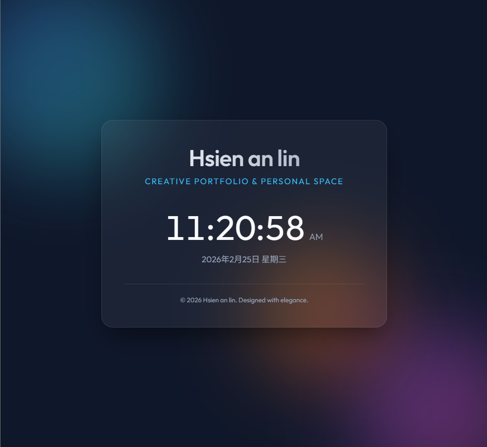

# 工作總結 - 2026-02-25

今天為 **Hsien an lin** 完成了個人網頁的開發與部署，以下是詳細的工作紀錄：

## 1. 個人網頁開發 (Personal Web Page)

- **設計風格**：採用了高品質的現代設計，包含：
    - **Glassmorphism (玻璃擬態)**：半透明磨砂質感容器。
    - **動態背景**：帶有動畫效果的漸層背景顏色球 (Animated Blobs)。
    - **優質字體**：使用了 Google Fonts 中的 'Outfit' 字體。
- **功能開發**：
    - **實時時鐘**：每秒更新的數位時鐘 (12小時制)。
    - **動態日期**：自動顯示當前的完整日期。
    - **互動效果**：滑鼠懸浮時的卡片視覺回饋。

## 2. 環境配置與自動化
- **環境檢查**：發現系統未安裝 Git。
- **Git 安裝**：透過 Windows `winget` 命令行自動安裝了最新版本的 Git。
- **環境變數配置**：在過程中自動處理了 PATH 環境變數，確保命令即時生效。

## 3. 代碼管理與雲端備份 (GitHub)
- **本地初始化**：在 `C:\Users\user\.gemini\antigravity\scratch\hsien_an_lin_page` 初始化了 Git 儲存庫。
- **GitHub 推送**：
    - 設定遠端儲存庫：`https://github.com/an7172799-ship-it/0225DRL_DIC1.git`
    - 分支操作：將主分支更名為 `main`。
    - 成功將所有源代碼 (`index.html`, `style.css`, `script.js`) 推送到雲端。

## 檔案路徑與資源
- **本地專案目錄**：`C:\Users\user\.gemini\antigravity\scratch\hsien_an_lin_page`
- **GitHub 連結**：[0225DRL_DIC1](https://github.com/an7172799-ship-it/0225DRL_DIC1.git)
- **Demo 演示站點**：[點此查看預覽](https://an7172799-ship-it.github.io/0225DRL_DIC1/)

---
*由 Antigravity AI 總結生成*
